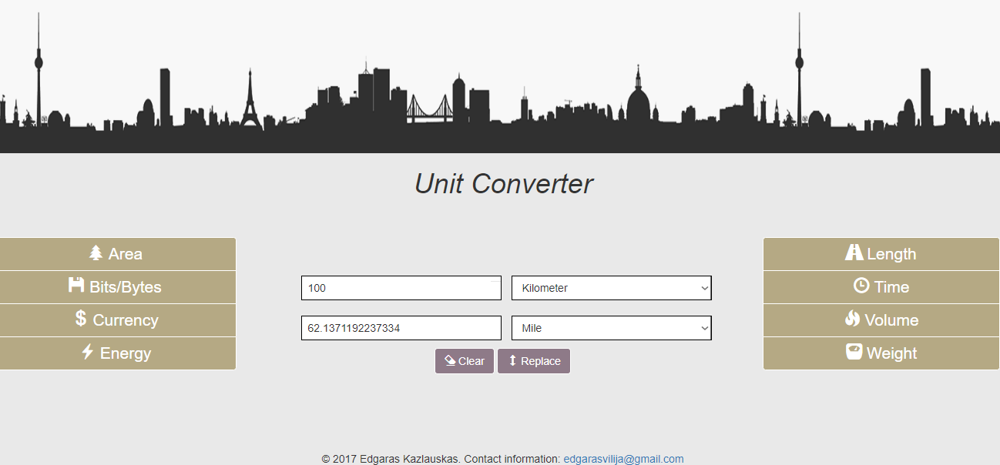

# Unit Converter

Web based unit converter which converts the most common units of measurement. 

Types of convertion included in the application:
	Area, Bits/Bytes, Currency, Energy, Length, Time, Volume, Weight
 

## Technologies used

+ JavaScript
+ HTML
+ CSS
+ Bootstrap

## Getting Started

In order to run the project a small amount of prerequisites and additional steps have to be fulfilled.

### Prerequisites

+ Web browser

### Running

+ Clone the project from GitHub repository
+ Open `index.html` file